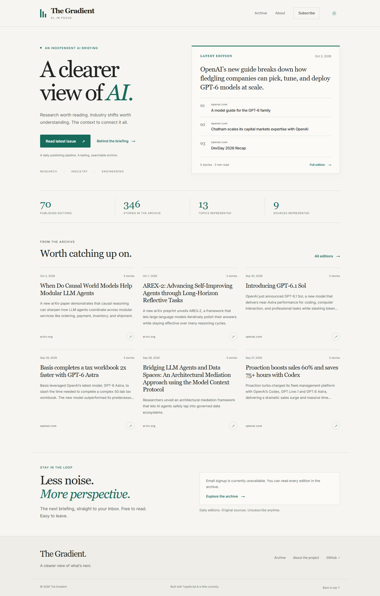
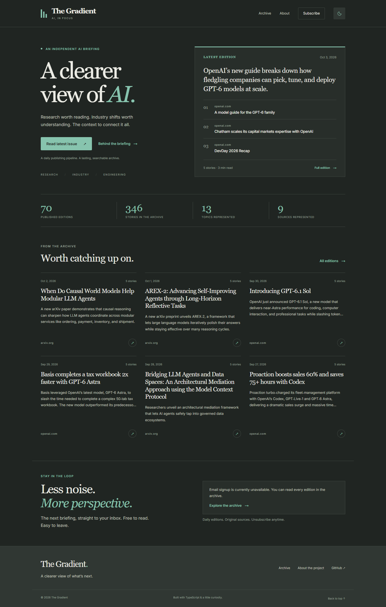
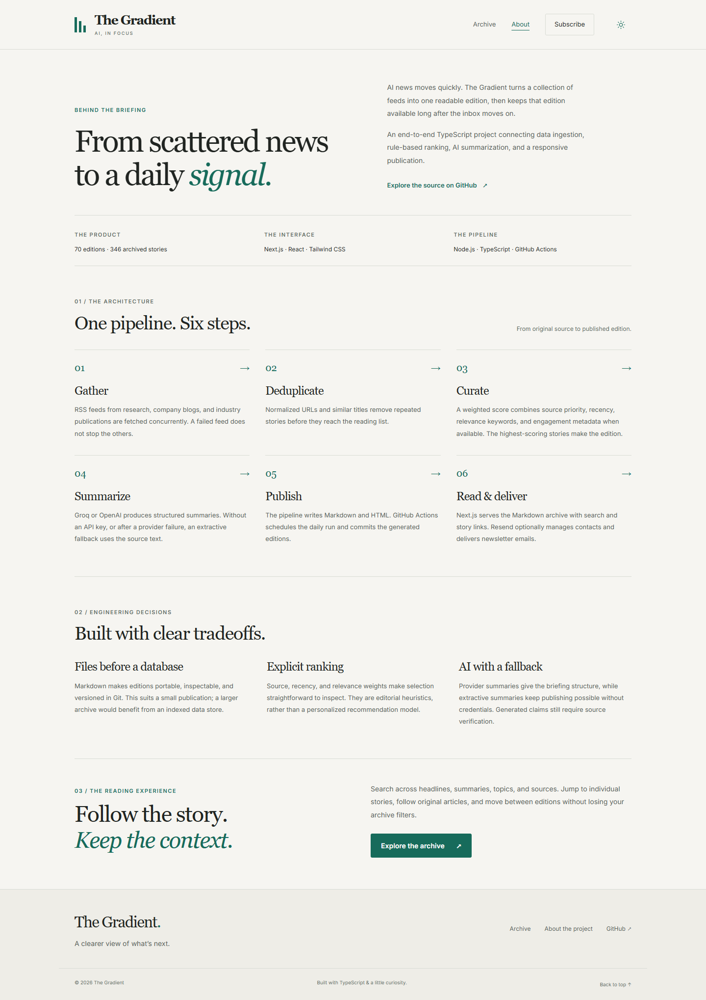
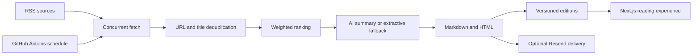

# The Gradient

**A clearer view of AI.** A daily briefing built with an automated TypeScript publishing pipeline and a Next.js reading experience.

The project connects RSS ingestion, deduplication, weighted story selection, AI summarization, and Markdown/HTML publishing. Readers can search the archive, jump to individual stories, follow original sources, and subscribe when email delivery is configured.

[](https://github.com/sgohils/The-Gradient-AI-Newsletter/actions/workflows/ci.yml)



<details>
<summary>Dark mode, mobile, and project architecture</summary>






</details>

## What it demonstrates

- **Full-stack delivery:** a Node.js pipeline produces the same Markdown editions the Next.js app reads.
- **Resilient ingestion:** feeds are fetched concurrently; a failed feed does not prevent other sources from contributing. URLs and similar titles are deduplicated.
- **Inspectable curation:** stories are ranked using source priority, recency, relevance keywords, and engagement metadata when present.
- **Provider integration:** Groq or OpenAI generates structured summaries, with an extractive fallback when keys are absent or requests fail.
- **Product design:** an editorial interface with light/dark themes, responsive layouts, source attribution, keyboard controls, and reduced-motion support.
- **Engineering hygiene:** scoped unit tests, mocked signup and delivery regressions, browser smoke tests, production builds, and GitHub Actions checks.

The website’s **About** page explains the implementation and its tradeoffs. Publication counts come from the archive, rather than hardcoded demonstration metrics.

## Try the website locally

Requires **Node.js 20 or newer** and npm. Browsing the checked-in editions requires no API keys.

```bash
# From the repository root
npm ci --prefix web
npm run dev --prefix web
```

Open [localhost:3000](http://localhost:3000). Explore the homepage, [archive](http://localhost:3000/archive), [About page](http://localhost:3000/about), or [subscription page](http://localhost:3000/subscribe).

Without a Resend key, signup displays an unavailable message and links to the archive. It does not simulate a successful subscription.

For a production build:

```bash
npm run build --prefix web
npm run start --prefix web
```

## Architecture



The pipeline selects up to five stories per edition by default. The curation score weights source priority at 25%, recency at 35%, relevance at 30%, and engagement at 10%. RSS entries currently do not supply engagement metadata, so that component normally contributes zero.

Generated issues live in `posts/`. The frontend parses their frontmatter and Markdown sections on the server. Archive search matches issue titles, intros, tags, article headlines, summaries, sources, and URLs. Pagination and filters stay in the URL, including when returning from a reading page.

## Run the pipeline

```bash
npm ci
npm run dev -- --dry-run
```

Dry-run fetches live feeds and creates Markdown/HTML previews in an OS temporary directory. It skips publication to `posts/`, image generation, subscriber lookup, and email delivery. If an LLM key is configured, summarization still calls that provider; without one it uses the extractive fallback.

To publish an edition:

```bash
npm run publish
```

This writes to the output directory and delivers email when Resend is configured and contacts are available. The daily publisher targets **07:17 UTC**, with recovery attempts at **10:17 and 13:17 UTC**. Attempts use the latest default branch, reuse an already committed edition without emailing it again, and skip an already published YouTube video. GitHub can delay scheduled triggers; check the run summary for publication status and the video activation switches.

## Configuration

Copy the root configuration example to `.env` for the pipeline, and the web example to `web/.env.local` for the website. Both examples are optional for local browsing.

| Variable | Used by | Purpose |
| --- | --- | --- |
| `GROQ_API_KEY` | Pipeline | Groq summarization; takes precedence when both provider keys exist |
| `OPENAI_API_KEY` | Pipeline | OpenAI summarization when no Groq key is set |
| `RESEND_API_KEY` | Pipeline and website | Contacts, newsletter delivery, and website signup |
| `MAILER_FROM_EMAIL` | Pipeline | Sender address; use a verified sender for delivery |
| `NEWSLETTER_BASE_URL` | Pipeline and website | Public URL for unsubscribe links and absolute social metadata |
| `OUTPUT_DIR` | Pipeline | Generated issue directory; defaults to `posts` |
| `GRADIENT_IMAGE_GEN` | Pipeline | Set to `off` to disable optional featured images |
| `PIXAZ_API_KEY` | Pipeline | Optional Pixazo image generation |
| `GRADIENT_IMAGE_MODEL` | Pipeline | `flux` or `turbo` |

Provider keys stay on the server. The configuration examples contain no credentials. The website defaults its metadata URL to localhost; set `NEWSLETTER_BASE_URL` to the hosted URL when deploying.

An optional root `config.json` can override the pipeline configuration, including a custom source list and model settings. Source IDs passed with `--sources` must appear in that custom list. See the configuration loader and source definitions for the supported fields; curation weights are defined separately in the curator rules.

## Checks and browser verification

```bash
# Pipeline
npm test
npm run lint
npm run typecheck
npm run build

# Website
npm test --prefix web
npm run lint --prefix web
npm run typecheck --prefix web
npm run build --prefix web
```

The pipeline test configuration targets the main `__tests__/` directory, excluding local worktree copies. Website tests cover archive queries, parsing, Markdown rendering, story links, date handling, and subscription responses. The dry-run regression configures a mock email provider and verifies that neither subscriber lookup nor delivery is called.

To run browser smoke tests after building the website:

```bash
cd web
npx playwright install chromium
npm run test:e2e
```

These checks exercise desktop, tablet, and mobile layouts in both themes, search/return navigation, invalid dates, keyboard navigation, reduced motion, and unconfigured signup. They use a separate local server on port 3005. Set `PLAYWRIGHT_CHANNEL=chrome` to use an installed Chrome instead of Playwright’s Chromium.

After UI changes, regenerate the README screenshots with `npm run screenshots` from `web/`.

## Tradeoffs and limitations

- **Markdown rather than a database:** editions are portable and versioned, but search scans the archive. Larger publications would benefit from an index and durable content storage.
- **Heuristic ranking:** selection is transparent, but depends on hand-tuned priorities and feed availability. It is not personalized.
- **Generated summaries:** source links enable verification; model-generated claims and numbers still require review. There is no automated factuality evaluation or human editorial approval workflow.
- **Optional external services:** live ingestion depends on feeds, and email/image generation requires configured providers. Existing image files are ignored by Git and must be supplied separately when hosting editions that reference them.
- **Email scope:** signup adds a contact; it does not send a confirmation email. The current integration does not implement double opt-in or authenticated unsubscribe tokens.
- **Hosting:** standalone builds include the Markdown archive. A hosted deployment must keep that archive in sync with newly published editions and supply its public/static assets.

## Project layout

| Area | Responsibility |
| --- | --- |
| `src/` | Fetching, curation, summarization, publishing, email, and configuration |
| `scripts/` | Pipeline and image-backfill entry points |
| `posts/` | Generated Markdown/HTML editions |
| `web/` | Next.js routes, API handlers, reading interface, and browser checks |
| `__tests__/` | Pipeline unit and integration tests |
| `.github/workflows/` | Quality checks and scheduled publishing |
| `DESIGN.md` | Visual system and interaction conventions |

MIT licensed.

Daily AI videos: see [video setup and activation](docs/video-pipeline.md) for free CPU rendering, previews, account connections, and TikTok consent. Commands: `npm run video:render` and `npm run video:publish`. Live video publishing starts disabled.
